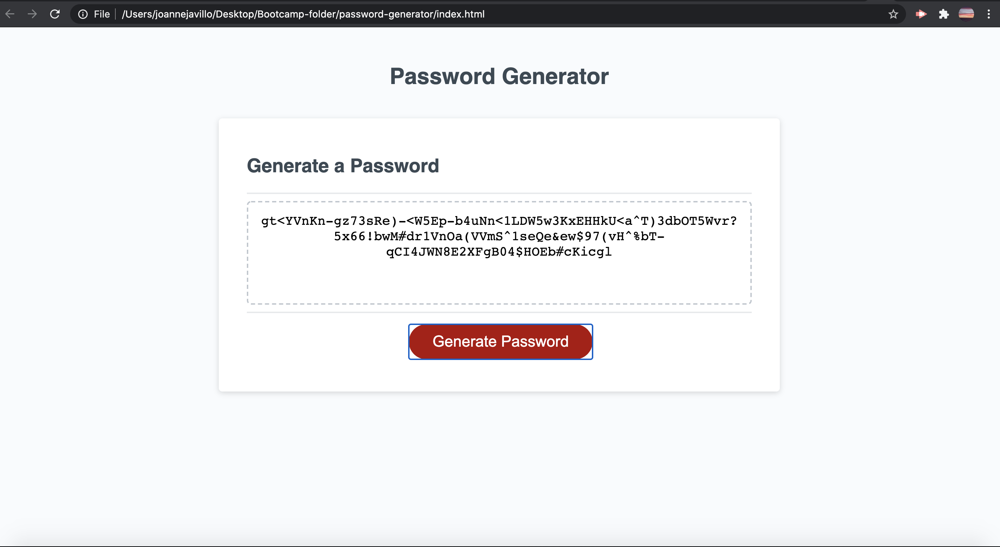
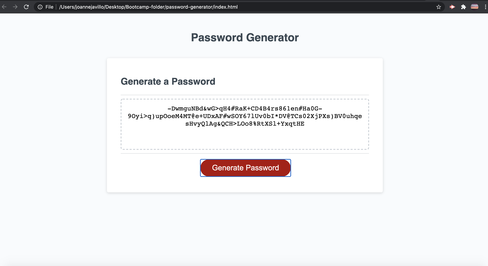
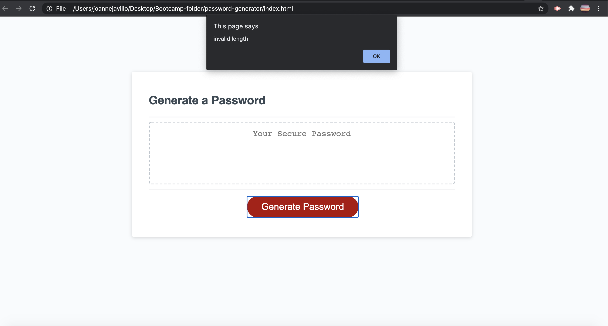
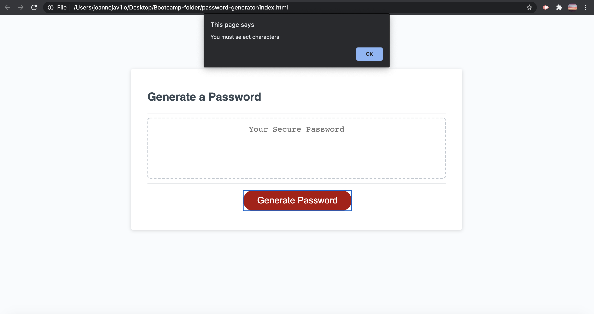
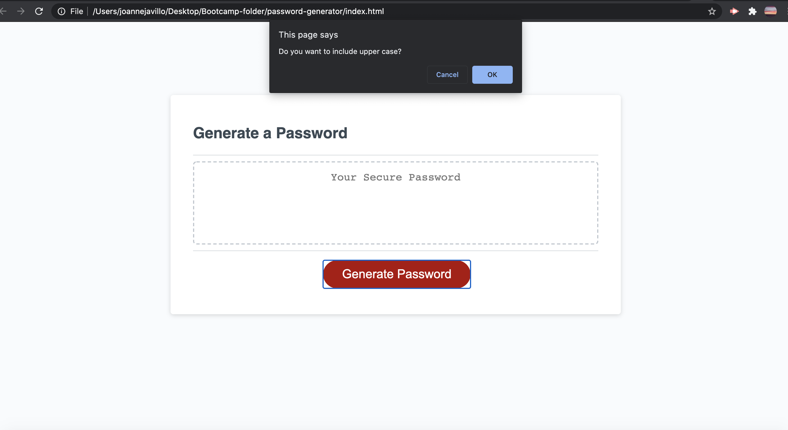

# Password-generator

---
> This exercise gave me the opportunity to learn more about Javascript.
> It gave me an insight on how big is the role of Javascript in programming.

---
## Goal of this activity 
**To be able to generate a random password that will pass all the criteria.** 
 -  When you click the button it should give you a random password with a length of 8-128 characters.
 - That it should have an uppercase, lowercase, numeric and/or special characters depending on the user's preference.
 - That the input should be validated and at least one character type should be selected.
 -  That all prompts are answered.

---
 ## Javascript
 - Learned the use of variables, functions, console logs, array, conditional statements, Math.random, for loop.

## Screenshots of the Password generator

  
- 128 password characters 
---

- another image of 128 characters
---

- image of prompt that the user keyed in an invalid length of characters
---

- image of prompt when the user did not meet the character requirement to generate the password
---

- image of one of the criteria to be able to generate a password